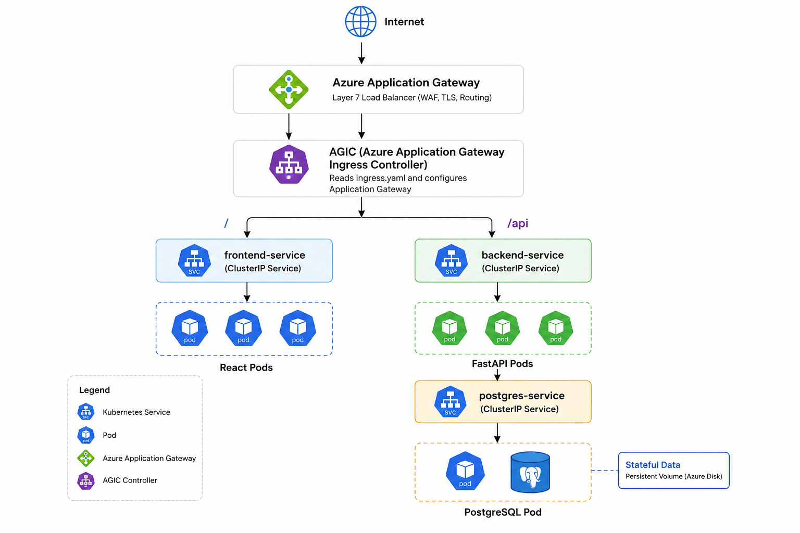

# Introduction

A full stack 3 tier Employee Directory application built and deployed using modern DevOps practices on Microsoft Azure

# Architecture
<p align="center">
  
</p>

#  Local Development

## Prerequisites
- Docker Desktop
- Node.js 18+
- Python 3.11+

## Run locally
```bash
# Clone the repo
git clone https://github.com/sravanimetlapalli/employee-directory.git
cd employee-directory

# Start all services
docker-compose up --build

# Run migrations
docker-compose exec backend alembic upgrade head
```
## Validation
- Frontend: http://localhost:3000
- API docs: http://localhost:8000/docs
- Health: http://localhost:8000/health

## Azure Infrastructure

Provisioned with terraform:
```bash
cd terraform
terraform init
terraform plan -out=tfplan
terraform apply tfplan
```

Created resources are:
- Resource Group
- Virtual Network + Subnet + NSG
- Azure Container Registry
- Log Analytics Workspace
- AKS Cluster with AGIC

## Kubernetes Deployments
```bash
# Connect to AKS
az aks get-credentials \
  --resource-group rg-employee-directory \
  --name aks-employee-directory

# Deploy all manifests
kubectl apply -f k8s/namespace.yaml
kubectl apply -f k8s/configmap.yaml
kubectl apply -f k8s/secrets.yaml
kubectl apply -f k8s/postgres-statefulset.yaml
kubectl apply -f k8s/backend-deployment.yaml
kubectl apply -f k8s/frontend-deployment.yaml
kubectl apply -f k8s/services.yaml
kubectl apply -f k8s/ingress.yaml

# Run migrations
kubectl exec -it \
  $(kubectl get pod -l app=backend -n employee-directory \
  -o jsonpath='{.items[0].metadata.name}') \
  -n employee-directory \
  -- alembic upgrade head
```

Destroy AKS when not in use: `terraform destroy`

## Author
Sravani Metlapalli — [LinkedIn](https://linkedin.com/in/sravanimetlapalli)
